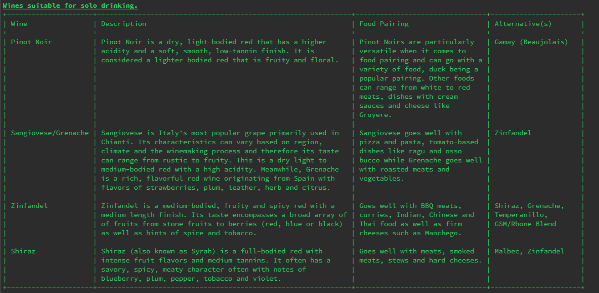
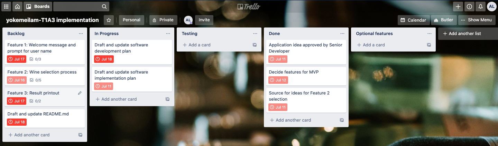

# Terminal application name: Personal Wine Assistant Terminal Application

## User Guide
### Starting up the Wine Assistant Terminal Application
1. Open up the Terminal
2. Navigate to the 'yokemeilam_T1A3/src' folder
3. Accompanying tags can be used to bring up special instructions:-
    * `./main.py --about` will bring up a short summary of the application
    * `./main.py --help` will bring up a short help file for the application
4. To run the application, type in the command:
    `./main.py`
5. For optimum display of results, a minimum terminal width of 145 columns is recommended. To find out terminal size use the command:
`stty size` - this will display the terminal size by rows and columns.

### Application summary
1. A welcome message will be printed to the user's terminal with a basic user guide 
2. User will be prompted for his/her age. If below legal drinking age of 18, the application will automatically exit. 
3. If above 18, user will be prompted for his/her name. User has the ability to change his/her name until it is confirmed. 
4. Once name is confirmed, wine selection begins, user will be prompted at every stage of the process with either numbered or yes/no options. Invalid options will be checked at every input point and user will be prompted until a valid response is received. 
5. During the selection process, if user enters in 'b' as an input, he/she will be taken to one step back in the selection process and user will be able to correct his/her entry. Users have the ability to go all the way back one-step each time, to the first question in the selection process. 
6. At the end of each selection process, the result(s) will be printed out for the user for that specific purpose.
7. User will be prompted if he or she would like to select wine for another purpose. The selection process will re-initiate again for another purpose and results will display at the end of each selection process. User can repeat the process as many times as required.
8. Once wines have been selected for all of the user's purpose(s), a summary will be printed if more than one purpose was selected before the application prints a goodbye message before exiting.

### File Structure
* [README](yokemeilam-T1A3-README.md) - Contains all documentation other than the development log. This includes the software development plan, implementation plan and testing documentation. 
* [Development log](yokemeilam-T1A3-development_log.md) - contains daily log of activities during the developemtn of this application. 
* [docs](yokemeilam-T1A3-docs) - contain all images and resources referenced on README.
* [src](yokemeilam-T1A3-src) - source code of the application containing three modules:-
    *  [main.py](yokemeilam-T1A3-src/main.py) - executable file for the application.
    * [functions.py](yokemeilam-T1A3-src/functions.py) - contains all functions written for the application.
    * [winelibrary.py](yokemeilam-T1A3-src\winelibrary.py) - contains all libraries referenced in functions.py

## Software Development Plan - Personal Wine Assistant Terminal Application
### Statement of Purpose and Scope

#### Purpose
The main objective of this application make wine selection more approachable by selecting appropriate type(s) of wine based on a user's circumstances. Suitable of wine can be tailored to reasons such as cooking/pairing with food, social drinking, solo drinking or celebratory drinking etc. 

#### Target Audience
The intended target audience of this application is for people who:-
* enjoys the occasional bottle/glass of wine
* does not have much knowledge about wines but wants to have something suitable certain occasions
* may or may not have access to a personal sommelier/friend who knows about wine
* need help selecting wine for different preferences or circumstances

#### Problems addressed
This application is intended to educate and assist in selecting appropriate wines for any occasion akin to having a personal digital sommelier. This will help reduce anxiety or feelings of inadequacy for someone who don't consider themself a connoisseur but would still like to select appropriate wine for certain settings. 

#### User Interaction and Experience
**User guide** - A full user guide can be found in this file with steps required to initialise and run the application in the terminal and show examples of the selection process along with how results will be displayed. 

A mini help file is also available to the user by passing the --help argument when initialising the application as well as at the beginning of the application once it is launched.

**User Interaction** - User will interface with the application using basic commands within the command shell. The application will prompt user for the user's age and name at the beginning and will guide user through the decision making process by presenting options which user will select at every stage making it an interactive process. At the end of the process, user will be presented with the best type of wine(s) that suits the options entered. 

**Error handling** - at each point of the program where the user is prompted for an input, checks will be put in place to ensure the validity of the user entries. While loops can be used to continually prompt users until a valid entry is obtained. Certain errors such as the printing of results are also handled by try-except blocks to display different results for lists and/or strings.

### Features in the final product
#### Minimal Viable Product (MVP)
* **Feature 1**: Welcome message and ability for user to input name at the start and insert user name where possible to give a more personalised feel in the application. 

* **Feature 2**: Wine selection process based on an adapted flow chart that provides different options of wine for different circumstances.

* **Feature 3**: Accurate results displayed at the end of each selection process accompanied with their descriptions, food pairing options and suitable alternatives where available. 

#### Additional features not in the original plan for MVP
* **Feature 4** - An age checking feature that acts as a gatekeeper preventing the use of the application by person(s) under the legal drinking age of 18. 

* **Feature 5** - A move backwards navigational feature incorporated into Feature 2 allowing users to navigate backwards one step at a time all the way back to the first selection step. Users will not be able to proceed beyond the first selection step.

* **Feature 6** - Selection of multiple wines for multiple purposes enabled. All selections will be stored in the application and summarised at the end of all selections. 

* **Feature 7** - Exit function allowing user to exit at any point in the application other than at y/n steps.

### Feature(s) not implemented
Curses was explored to generate interactive menus for the selection process but was unable to be implemented and tested within the given timeframe. Perhaps it may be implemented in version 2.

## Software Implementation Plan

The Implementation of the Personal Wine Assistant application is based on the definition of the acceptable [minimal viable product](#MVP) above.

The implementation of the application was broken down into the planning phase, resource gathering phase, coding phase and testing phase for all features. The gathering of resources must be completed by Jul 13 for coding work to begin. The implementation of the coding and testing phase are as laid out below: 

**Features 2 and 3** were considered to make up the largest parts of the minimal viable product and will be developed concurrently as features are interdependent especially in ensuring specific wines are selected for their specific purposes. **Note**: Due dates below indicate the date that feature development and testing must be completed. Prioritisation lies on completing the coding for all three features before proceeding to test the code as a whole. Additional features can be added as long as there was enough time for implementation and testing by the main due dates. 
**Feature 2** was prioritised as the top feature as it is the most specific and is the main crucial feature for the application to fulfill its purpose. It was broken down to the following tasks and was given a due date of **July 16**. Tasks 2, 3, and 4 were to be developed concurrently to be completed and tested by the due date of Feature 2.
1. Resource gathering - Plan out and simplify wine selection process from the [Wine Folly Wine Selection Chart](https://media.winefolly.com/how-to-choose-wine-infographic.png#fullsize.). *Due Date*: July 11
2. Implement the selection flow based on the adapted flow chart from Task 1 in code. This task will be allocated a minimum of 3 days to complete. *Due Date*: July 16
3. Error checking must be implemented at every selection stage to ensure a valid user input to proceed the the correct downstream stages as well as select the correct wine. This was to be implemented together with Task 2. *Due Date*: July 16
4. Valid options at each stage of the selection is saved onto a list that can be used as a referral to the appropriate library to display selected wines and their descriptors. *Due Date*: July 16.

**Feature 3** was prioritised after the completion of **Feature 2** and given a due date of **July 17**. It was broken down into the following tasks:-
1. Resource gathering- Establishment of the wine description library with description, food pairing options and suitable alternatives if available. This involved finding information on the internet and populating the description library on the winelibrary module. Due date: Jul 14
2. Once task 1 is completed, coding work to be completed for the correct wines to be referenced for the correct purpose from the outputs of Feature 2. Due date: Jul 17

**Feature 1** was considered a minor feature to be implemented once Feature 2 and 3 were completed. This was given a due date of Jul 17 Tasks that were crucial for the implementation of Feature 1 included: 
1. A welcome section with a message and navigational help instructions for the application.
2. Prompting user for to enter name that will be stored in a name variable that can be referenced throughout the application where required.
3. Confirmation step to enable user to confirm his/her name. This step will repeat until user confirms his/ her name. 

### Actual implementation
Refer to [Development log](yokemeilam-T1A3-development_log.md) for a day to day log of the project implementation. Here are some highlights of the implementation of this project.

#### Planning phase

Jul 10 - planning phase

#### Implementation phase

Jul 12 - Coding work began upon completion of resource gathering for Feature 2.

Jul 13 taskboard - Coding work for Features 2 and 3

The first version of code of all three features were completed by Jul 13. An additional feature (**Feature 4**) for checking age was added on Jul 13. This feature now made up the first step of the application before prompting user for his/her name to check for whether user was above the legal drinking age of 18. 

Jul 14 taskboard - Incorporating Feature 5

The code for version 2 was reworked several times to DRY it out on Jul 13. On Jul 14, further rework of Feature 2 code was done when there was time to implement an additional feature(**Feature 5**) to enable backward navigation during the selection process. In order to enable this feature, Feature 2 was reworked to while loop instead of using the original flow control (if and else statements).

Jul 15 taskboard - Testing phase begun

Jul 16 taskboard - First round testing completed, bug fixing and Feature 6 implemented.

The winelibrary in version 3 was completed on Jul 13 and was further DRY-ed on Jul 14 by condensing the purpose and wine list into a single library. Feature 2 also required recalibration to point to the correct reference. Further organisation of the presentation of information on the app was done using the prettytables module on Jul 16. Decision to implement the final feature- **Feature 6** prior to the testing phase of the application. **Feature 6** enabled users to restart the selection process to select wines for more than one purpose. This can be repeated as many times and a summary will be printed once the user has completed all of his/her selection of wines. Implementation of Feature 6 marks the completion of the application with enough time for testing before the due date. 

Jul 17 taskboard - testing and bug fixing completed. Documentation being updated.

A demo video was shared with a fellow colleague for feedback and the suggestion of **Feature 7** arose. where users can type 'exit' at any point in the application to exit the app. This was successfully implemented on Jul 17.

|           | MVP/Additional Feature | Due date | Resource Gathering | Coding | Testing |
|-----------|------------------------|----------|--------------------|--------|---------|
| Feature 1 | MVP                    | Jul 17   | N/A                | Jul 12 | Jul 16  |
| Feature 2 | MVP                    | Jul 16   | Jul 11             | Jul 14 | Jul 17  |
| Feature 3 | MVP                    | Jul 17   | Jul 13             | Jul 15 | Jul 17  |
| Feature 4 | Additional feature     | Jul 17   | N/A                | Jul 13 | Jul 16  |
| Feature 5 | Additional feature     | Jul 17   | N/A                | Jul 14 | Jul 16  |
| Feature 6 | Additional feature     | Jul 17   | N/A                | Jul 16 | Jul 16  |
| Feature 7 | Additional feature     | Jul 17   | N/A                | Jul 17 | Jul 17  |

Testing of all features were planned for and completed on Jul 17. 

### Resources/References
1. Winefolly.com. https://media.winefolly.com/how-to-choose-wine-infographic.png#fullsize. Published 2020. Accessed July 10, 2020.
2. https://www.facebook.com/WineFolly. Common Types of Wine (top varieties to know) | Wine Folly. Wine Folly. https://winefolly.com/deep-dive/common-types-of-wine/. Published May 18, 2015. Accessed July 12, 2020.
3. Sangiovese Wine - Wine Varieties | Cellarmasters. Cellarmasters.com.au. https://www.cellarmasters.com.au/discover/wine-varieties/sangiovese. Published 2018. Accessed July 12, 2020.
4. McWilliams Admin. Pinot Grigio vs Pinot Gris. McWilliam’s Wines. https://mcwilliams.com.au/blogs/news/pinot-grigio-vs-pinot-gris. Published January 2, 2018. Accessed July 12, 2020.
5. Bordeaux Vs. Burgundy: Battle Of The French Wines. The Upsider. https://theupsider.com.au/bordeaux-burgundy-wines/19422. Published October 21, 2019. Accessed July 12, 2020.
6. Schiessl C. We Need a Better Way to Talk About Red Blends. VinePair. https://vinepair.com/articles/whats-a-red-blend/. Published August 22, 2017. Accessed July 12, 2020.
7. Wikipedia Contributors. Box wine. Wikipedia. https://en.wikipedia.org/wiki/Box_wine#:~:text=Boxed%20wine%20(cask%20wine)%20is,a%20cork%20or%20synthetic%20seal. Published June 22, 2020. Accessed July 12, 2020.
8. Wikipedia Contributors. Cleanskin (wine). Wikipedia. https://en.wikipedia.org/wiki/Cleanskin_(wine). Published September 28, 2019. Accessed July 12, 2020.